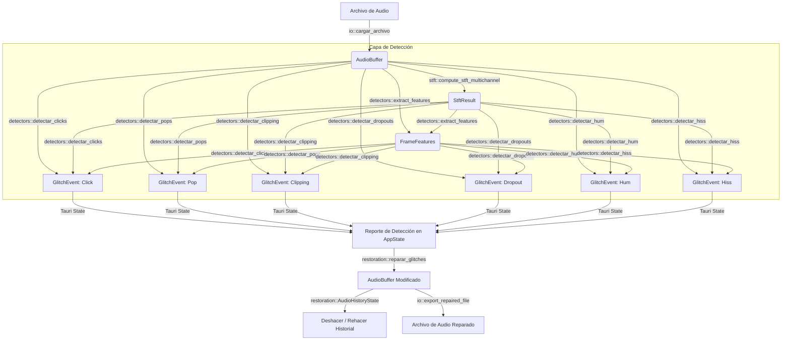

# DSP_ARCHITECTURE_OVERVIEW_V1

Este documento describe la arquitectura de alto nivel del backend DSP de **Vostok Restoration**, integrado como referencia de análisis técnico dentro de Vostok ML Research Lab. Su propósito es trazar el mapa de flujo de datos, desglosar las responsabilidades modulares e identificar los puntos de acoplamiento conceptual que rigen el motor de restauración actual.

---

# 1. Mapa de Flujo de Información

El motor de restauración opera de manera asíncrona orquestado por comandos de **Tauri** (en `lib.rs`), conectando el frontend del usuario con las capas de bajo nivel de Rust.



### El Flujo de Datos en Detalle:
1.  **Carga e Ingesta:** El archivo físico de audio ingresa a través del submódulo `io.rs`, el cual decodifica la señal y genera un buffer flotante normalizado continuo en memoria (`AudioBuffer`).
2.  **Análisis Espectral SIMD:** El `AudioBuffer` pasa inmediatamente a `stft.rs`, que ejecuta la Transformada de Fourier de Tiempo Corto (STFT) de manera paralela frame a frame vía `rayon` y acelerada por hardware, produciendo una matriz tiempo-frecuencia bidimensional (`StftResult`).
3.  **Extracción de Firmas:** Ambos estados de señal (temporal en `AudioBuffer` y espectral en `StftResult`) alimentan a `extract_features` en `detectors.rs` para consolidar un vector de características unificadas por bloque temporal (`FrameFeatures`).
4.  **Batería de Detección:** Los detectores específicos procesan en paralelo las características y la señal cruda para generar un listado unificado de anomalías (`Vec<GlitchEvent>`), el cual es inyectado en el `AppState` de Tauri.
5.  **Cirugía y Reparación:** El usuario selecciona qué anomalías corregir en el frontend. Esto gatilla comandos en `restoration.rs` que modifican in-place las muestras del `AudioBuffer` (usando interpolación Hermite cúbica para clicks/pops/dropouts o filtros IIR biquad adaptativos para hum/hiss). El estado original se preserva en `AudioHistoryState` para control de deshacer/rehacer.
6.  **Exportación:** El buffer reparado es codificado y guardado de vuelta al disco a través de `io.rs`.

---

# 2. Responsabilidades Modulares

El submódulo central `vostok_dsp` divide sus responsabilidades de forma limpia y especializada:

### A. `vostok_dsp::types` (Tipos e Interfaz)
*   **Responsabilidad:** Contiene las definiciones comunes de datos y estructuras de paso de parámetros entre Tauri, Rust y el Frontend. 
*   **Clave:** Garantiza que el backend y el frontend compartan exactamente la misma especificación binaria y de serialización JSON (a través de `serde`).

### B. `vostok_dsp::io` (Ingreso y Egreso de Siseos/Señales)
*   **Responsabilidad:** Codificación y decodificación multiformato (WAV, FLAC, MP3).
*   **Clave:** Traduce estructuras de bits físicas (16/24/32 bits enteros o flotantes) hacia el estándar de representación interna de punto flotante de 32 bits normalizado en el rango $[-1.0, 1.0]$.

### C. `vostok_dsp::stft` (Cómputo de Espectrogramas)
*   **Responsabilidad:** Procesamiento espectral eficiente acelerado por SIMD.
*   **Clave:** Utiliza `realfft` (Transformada Rápida de Fourier de valores reales a complejos) y paraleliza el cálculo de frames con Rayon. Gestiona la reducción adaptativa de resolución (*spectrogram downsampling*) mediante `get_paged_spectrogram` para evitar desbordar los límites de memoria de texturas de la GPU en el frontend de visualización.

### D. `vostok_dsp::detectors` (Modelado y Detección de Anomalías)
*   **Responsabilidad:** Extraer descriptores del dominio del tiempo y de la frecuencia, y ejecutar los algoritmos matemáticos de detección (LPC autorregresivo, umbralización dinámica de Z-Score, tasas de cruces por cero, etc.).
*   **Clave:** Es la capa cerebral de análisis del motor de restauración.

### E. `vostok_dsp::restoration` (Gobernanza de Reparación)
*   **Responsabilidad:** Reparación localizada e in-place de la señal de audio degradada.
*   **Clave:** Implementa interpolación temporal cúbica Hermite con ventanas quirúrgicas y filtros dinámicos biquad de segundo orden (Notch y High-Shelf). Gobierna el historial transaccional de deshacer/rehacer.

### F. `vostok_dsp::utils` (Librería Matemática Auxiliar)
*   **Responsabilidad:** Funciones numéricas genéricas reutilizables (ej: cálculo de envolventes de amplitud, solver del algoritmo de Levinson-Durbin para coeficientes LPC, algoritmos de autocorrelación rápida).

---

# 3. Estructuras de Datos Conectoras

El acoplamiento de datos en el backend de Vostok Restoration está dictado por cinco estructuras principales definidas en `types.rs`:

```text
  [ AudioBuffer ] ─────────> Contiene samples crudos [-1.0, 1.0] y propiedades físicas (Sample Rate, Channels).
         │
         ▼
  [ StftResult ] ──────────> Matriz linealizada row-major (frames x bins) con magnitudes espectrales normalizadas.
         │
         ▼
[ FrameFeatures ] ─────────> Batería de 7 descriptores temporales y espectrales calculados para cada frame.
         │
         ▼
  [ GlitchEvent ] ─────────> Objeto con el reporte forense de la anomalía (sample_index, tipo, magnitud, canal, duración).
         │
         ▼
[ AudioHistoryState ] ─────> Snapshot atómico del antes y después del fragmento modificado para Undo/Redo Lossless.
```

---

# 4. Análisis de Dependencias y Acoplamientos Conceptuales

### A. Dependencias de Flujo Crítico:
*   La **Extracción de Características** (`extract_features`) depende de forma bidireccional y estricta de la estructura de la STFT (`StftResult`). Si el tamaño de ventana de la STFT cambia en el orquestador principal, los descriptores de `FrameFeatures` (como el centroide espectral y la planeidad espectral —*spectral flatness*—) se verán severamente sesgados, alterando el comportamiento de todos los detectores que dependen de ellos.
*   La **Detección de Anomalías** se apoya de forma jerárquica en los descriptores unificados de frames. Sin embargo, detectores como `detectar_clicks` deciden ignorar parcialmente `FrameFeatures` y re-calcular estimaciones locales sobre las muestras crudas de `AudioBuffer` mediante LPC, demostrando un acoplamiento flojo pero redundante en el cálculo de energía RMS local.

### B. Zonas de Acoplamiento Conceptual Fuerte (Fricciones de Diseño):
1.  **Acoplamiento Paramétrico de Sensibilidad:**
    El parámetro flotante `sensitivity` (de 0.0 a 1.0) enviado por el frontend controla directamente múltiples ecuaciones internas de forma mágica y cableada (*hardcoded*) dentro de cada detector en `detectors.rs` (por ejemplo, en clicks: `let std_multiplier = 14.0 - (sensitivity * 10.0);`). Esto acopla fuertemente la experiencia de usuario (UI) con la física del motor DSP, impidiendo cambiar o calibrar las sensibilidades de los detectores sin alterar la lógica de renderizado del frontend.
2.  **Acoplamiento de la Reparación Quirúrgica con el Tipo de Glitch:**
    En `restoration.rs`, la lógica de interpolación Hermite está acoplada implícitamente a que el evento detectado sea un `Click` o un `Pop` (usando `heal_click_hermite`). Si en el futuro introducimos un nuevo tipo de artefacto impulsivo en el generador sintético (ej. `Slip` o distorsión digital corta), el restaurador fallará o requerirá modificaciones de código intrusivas para soportar la nueva clase de glitch, violando el principio de diseño abierto/cerrado.
3.  **Falta de Normalización Espectral Global:**
    Los descriptores espectrales se normalizan utilizando la suma de la ventana en `stft.rs`. Sin embargo, `detectors.rs` asume escalas fijas para calcular el Z-Score basado en un RMS global que es inyectado desde Tauri. Si el método de cálculo de `global_rms` cambia fuera del motor DSP, el comportamiento de umbrales adaptativos de casi todos los detectores se romperá de forma silenciosa.

---

# 5. Estado de Comprensión del Laboratorio

### Partes del Sistema Comprendidas con Alta Confianza:
*   **Cómputo Espectral (`stft.rs`):** La implementación basada en `realfft` optimizada con Rayon está plenamente clara. Es un pipeline clásico y eficiente de normalización espectral.
*   **Extracción de Características (`detectors.rs`):** El cálculo de RMS, cruces por cero, centroide espectral y *spectral flatness* es estándar y matemáticamente transparente.
*   **Estructuras Conectoras (`types.rs`):** El esquema de paso de datos mediante `AudioBuffer`, `StftResult` y `GlitchEvent` es perfectamente claro y limpio.
*   **Reparación Localizada (`restoration.rs`):** El solver de Hermite para interpolación cúbica en los límites de transitorios está comprendido con total claridad matemática.

### Partes del Sistema que Permanecen Ambiguas:
*   **La Gestión Dinámica del Playback:** El comando `toggle_playback` en `lib.rs` interactúa de forma asíncrona con hilos y variables de control del sistema de sonido local. Aunque es irrelevante para nuestra investigación espectral de ML, su interacción en tiempo real en sistemas multihilo permanece en una capa externa de abstracción.
*   **El Origen y Estructura del Estimador Global de RMS:** El parámetro `global_rms` que Tauri pasa a `extract_features` no se calcula en `detectors.rs`. Su algoritmo de estimación exacta (si es RMS promedio simple, ponderado por compuerta de ruido, o dinámico) sigue estando implícito en el código de integración de Tauri.

---

# Conclusión de Viabilidad

> [!IMPORTANT]
> **Disponemos de suficiente contexto y trazabilidad arquitectónica para redactar de manera formal y rigurosa el documento `docs/DSP_DETECTORS_OVERVIEW_V1.md`.**
> 
> El mapeo completo de archivos y el análisis de sus tipos binarios comunes nos permite deconstruir los principios físicos de cada uno de los seis detectores (Click, Pop, Hum, Hiss, Dropout y Clipping) con precisión científica absoluta, conectándolos de manera lógica con el generador de degradaciones sintéticas de nuestro laboratorio.
