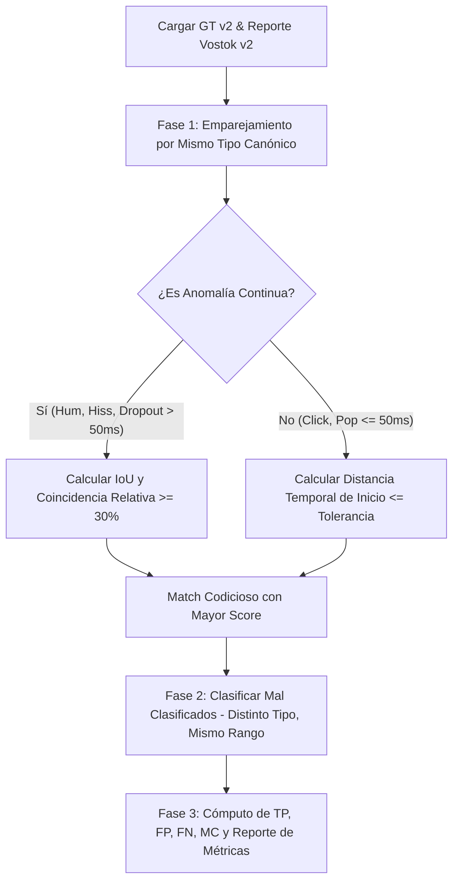

# EXPERIMENTAL_INFRASTRUCTURE_AUDIT_V1

Este documento presenta una auditoría técnica, matemática y deconstrucción conceptual de los scripts de inyección sintética y evaluación automática de **Vostok Restoration (v2)**: `degradar_audio_v2.py` y `evaluar_vostok_v2.py`. Su propósito es analizar con rigor de laboratorio la fidelidad física de las degradaciones, las limitaciones de representación del Ground Truth y los posibles sesgos del motor de métricas, sirviendo como mapa de ruta científico antes del inicio de **ML-LAB-002**.

---

# 1. Auditoría del Generador Sintético (`degradar_audio_v2.py`)

El generador consta de dos metodologías de inyección: el **Motor Heredado** (perfiles `default`, `transients`, `all_mixed`) y el **Motor Real-World** (`real_world`). A continuación se desglosa el modelado matemático de cada anomalía y sus asunciones físicas implícitas.

## A. Clicks e Impulsos

### Generación Matemática
*   **Motor Heredado:** Selecciona un índice aleatorio $n$ y sobrescribe la muestra de audio original $x[n]$ asignándole un valor estricto de saturación máxima $+1.0$ o $-1.0$. La longitud de la anomalía es de exactamente $1$ muestra. La magnitud registrada en el Ground Truth se calcula como la diferencia de amplitud: 
    $$\text{Magnitude} = |v_{\text{inyectado}} - x[n]|$$
*   **Motor Real-World:** Calcula el volumen total de clicks según la duración del audio ($8$ a $15$ clicks/minuto). En lugar de distribuirlos de forma uniforme, los agrupa en **clusters temporales** simulando la física del vinilo. Elige un centro de cluster $n_c$ y dispersa de $2$ a $5$ clicks en una ventana de $\pm 200\text{ ms}$ alrededor del centro, asignándoles de igual forma amplitud estricta de $+1.0$ o $-1.0$ y un ancho de exactamente $1$ muestra.

### Simplificaciones Físicas e Incongruencias
*   **Ausencia de Respuesta al Impulso (IR):** Un click analógico real (como la colisión de una aguja de vinilo con una mota de polvo o un salto electrostático en cinta) no es una Delta de Dirac perfecta de $1$ muestra. Físicamente, el sistema de reproducción y preamplificación aplica un filtrado RIAA y pasabajos severo, lo que transforma la discontinuidad en un pulso transitorio de fase dispersa con colas de oscilación libre amortiguada de frecuencia media-alta.
*   **Saturación Artificial Rígida:** Forzar el valor de la muestra a $\pm 1.0$ asume que todos los clicks de vinilo saturan el rango dinámico del digitalizador, ignorando clicks sutiles de bajo nivel que residen a $-20\text{ dB}$ o $-30\text{ dB}$.

### Parámetros Configurables
*   Dosis de inyección parametrizada por minuto del archivo de audio (clicks/min).
*   No posee control fino interactivo de amplitud ni de ancho del pulso.

---

## B. Pops y Thumps de Baja Frecuencia

### Generación Matemática
*   **Motor Heredado:** Elige un inicio $n$ y una duración de $20$ a $80\text{ ms}$. Genera una sinusoide de baja frecuencia amortiguada exponencialmente en el tiempo ($t_{\text{pop}}$):
    $$p[t] = \sin(2\pi f_0 t) \cdot e^{-30t}$$
    donde la frecuencia $f_0$ varía aleatoriamente entre $15\text{ Hz}$ y $40\text{ Hz}$. Introduce una **asimetría no lineal** multiplicando la porción negativa del ciclo por $0.2$. La amplitud del pop se regula aleatoriamente con una ganancia $A \in [0.5, 0.9]$ sumada de forma aditiva al audio.
*   **Motor Real-World:** Modela $1$ a $3$ pops/minuto con una duración de $15$ a $60\text{ ms}$, una oscilación $f_0 \in [20, 60]\text{ Hz}$ amortiguada con decaimiento ligeramente más rápido ($e^{-25t}$), asimetría negativa multiplicada por $0.3$ y amplitudes moderadas $A \in [0.2, 0.5]$.

### Simplificaciones Físicas e Incongruencias
*   **Alineación de Fase Estéreo Perfecta:** El script inyecta exactamente el mismo pop aditivo de forma coherente en fase y amplitud en ambos canales (L y R). En grabaciones de micrófono estéreo de campo, una plosiva o un golpe físico llega con diferencias de tiempo interaurales (ITD) e intensidad (ILD) notables debido a la separación espacial de las cápsulas.

### Parámetros Configurables
*   Rango de frecuencia ($15-40\text{ Hz}$ o $20-60\text{ Hz}$).
*   Rango de amortiguamiento y atenuación de asimetría negativa.

---

## C. Hum Electromagnético

### Generación Matemática
*   **Motor Heredado:** Inyecta un tono puro sinusoidal de $50\text{ Hz}$ ininterrumpido a lo largo de toda la pista con una amplitud estática de $0.05$.
*   **Motor Real-World:** Elige de $1$ a $4$ segmentos aleatorios de $2.0$ a $15.0$ segundos de duración. La amplitud se define entre $0.01$ y $0.05$. Inyecta una **fundamental armónica de red** que consta de $50\text{ Hz}$ y sus primeros dos armónicos superiores ($100\text{ Hz}$ al $50\%$ de volumen y $150\text{ Hz}$ al $25\%$ de volumen). Aplica un **fade-in/fade-out de 80 ms con curva coseno** en los bordes para suavizar la entrada y salida:
    $$h[t] = A \cdot \left[ \sin(2\pi \cdot 50t) + 0.5\sin(2\pi \cdot 100t) + 0.25\sin(2\pi \cdot 150t) \right]$$

### Simplificaciones Físicas e Incongruencias
*   **Estabilidad de Frecuencia Infinita:** El hum del laboratorio mantiene una frecuencia constante de exactamente $50.000\text{ Hz}$ sin desviación alguna. En el mundo real, la inestabilidad de la corriente de red alterna y, sobre todo, las fluctuaciones de velocidad física del motor de reproducción de cinta (*Wow & Flutter*) desplazan dinámicamente la fundamental y sus armónicos en el tiempo, ensanchando su bin espectral.

### Parámetros Configurables
*   Número de armónicos agregados (fijado en 3).
*   Amplitud de la fundamental ($0.01 - 0.05$).

---

## D. Hiss (Soplido de Banda Ancha)

### Generación Matemática
*   **Motor Heredado:** Agrega ruido blanco gaussiano ($\mu=0, \sigma=0.05$) continuo e ininterrumpido sobre toda la pista de audio.
*   **Motor Real-World:** Inyecta de $1$ a $3$ segmentos de $3.0$ a $12.0$ segundos de duración con una amplitud de $0.01$ a $0.04$. Aplica al ruido gaussiano una **envolvente trapezoidal con rampas coseno** que ocupan el $10\%$ del tiempo total del segmento en el fade-in y el $10\%$ en el fade-out.

### Simplificaciones Físicas e Incongruencias
*   **Blancura Espectral (Falta de Coloración):** Generar ruido blanco gaussiano puro asume que el siseo analógico posee energía plana por banda de frecuencia. Físicamente, el siseo de cinta magnética y preamplificadores térmicos sufre la ecualización pasabajos natural de los cabezales y los circuitos de reproducción (NAB, CCIR), comportándose como ruido rosa, ruido de alta frecuencia coloreado, o ruido con caídas marcadas en agudos.
*   **Correlación Estéreo Incorrecta:** El inyector clona el vector de ruido idéntico en el canal izquierdo y derecho (`np.column_stack`). Acústicamente, el hiss analógico es incoherente estéreo; el ruido magnético de una cinta presenta perfiles estocásticos completamente incorrelacionados en el espacio L/R. El hiss mono del inyector es una imprecisión física crítica.

---

## E. Clipping (Saturación)

### Generación Matemática
*   **Motor Heredado:** Multiplica la amplitud de un bloque temporal de $0.1$ a $0.5$ segundos por un factor de ganancia de $3.0$ y lo recorta de forma rígida a un umbral de recorte aleatorio entre $0.7$ y $0.95$.
*   **Motor Real-World:** Genera de $1$ a $2$ segmentos de $100$ a $300\text{ ms}$. Mide el pico local original (`peak_before`). Calcula una ganancia multiplicativa precisa para forzar que el pico original sobrepase el umbral de clip seleccionado en un $80\%$ ($\text{target\_peak} = \text{threshold} \cdot 1.8$). Aplica una envolvente de transición suave de $5\text{ ms}$ en los extremos del bloque para evitar clicks artificiales antes del recorte rígido.
*   **Compuerta de Validación Física:** El script cuenta físicamente el número de muestras que tocan el techo del recorte ($\text{amplitud} \ge \text{threshold} - 10^{-5}$). **Solo si existen más de 5 muestras saturadas** se registra el evento en el Ground Truth. Si la señal original era un silencio o sonido muy tenue que no alcanzó a recortarse, el script descarta la inyección para evitar falsos positivos de Ground Truth.

### Simplificaciones Físicas e Incongruencias
*   **Saturación Rígida (Hard Clipping):** El clipping del inyector es digital puro (achatamiento con esquinas duras). La saturación física en cinta o preamplificadores valvulares es no-lineal y de transición suave (soft-clipping), comprimiendo los picos dinámicos progresivamente y generando una distorsión armónica coloreada de decaimiento suave en lugar de una erupción infinita de armónicos impares de alta frecuencia.

---

## F. Dropouts (Caídas de Señal)

### Generación Matemática
*   **Motor Heredado:** Silencia rígidamente a $0.0$ absoluto un bloque de $10$ a $50\text{ ms}$ de duración.
*   **Motor Real-World:** Genera de $1$ a $4$ dropouts de escala ultra-corta de $5$ a $25\text{ ms}$ de duración, llevando las muestras a $0.0$ de manera abrupta y registrando el nivel RMS de la señal borrada como magnitud de daño.

### Simplificaciones Físicas e Incongruencias
*   **Caída Vertical y Total de Energía:** El dropout físico de cinta analógica se produce por una separación milimétrica de la cinta respecto al cabezal reproductor por acumulación de polvo o deformaciones físicas de la cinta. Esto actúa como un filtro pasabajos dinámico de atenuación progresiva (la energía de alta frecuencia decae masivamente mientras que las bajas frecuencias sobreviven parcialmente). Un silenciamiento digital total a $0.0$ es una simplificación extrema que distorsiona la naturaleza física del dropout analógico.

---

## G. Tabla de Contraste: Descripción Conceptual vs. Implementation Efectiva

| Artefacto / Elemento | Descripción Conceptual Previa | Implementación Real en Script (v2) | Impacto Científico |
| :--- | :--- | :--- | :--- |
| **Clicks** | Clicks de una muestra para evitar "flat-top". | Clicks de exactamente $1$ muestra de amplitud máxima $\pm 1.0$, agrupados en clusters en `real_world`. | El DSP está sobreajustado para impulsos de $1$ muestra de amplitud absoluta; fallará en clicks analógicos dispersos en fase. |
| **Pops** | Tonos sinusoidales amortiguados graves. | Sinusoide exponencial asimétrica ($15-60\text{ Hz}$) idéntica en fase y amplitud en ambos canales (mono). | No simula las diferencias interaurales reales de un pop estéreo acústico de campo. |
| **Hum** | Fundamental exacta de 50/60 Hz de red. | Fundamental estática de $50\text{ Hz}$ + 2 armónicos ($100, 150\text{ Hz}$) con fade coseno en `real_world`. | Al no tener fluctuación dinámica de velocidad (*Wow & Flutter*), el benchmark evalúa una condición artificial ultraestable. |
| **Hiss** | Ruido de soplido gaussiano plano agudo. | Ruido blanco gaussiano plano monoaural (clonado en L y R) con envolvente trapezoidal en `real_world`. | El siseo de cinta es estéreo incorrelacionado y espectralmente coloreado; el inyector genera siseo mono coherente plano. |
| **Clipping** | Recorte plano temporal de la señal de audio. | Recorte rígido a umbral local de ganancia compensada ($1.8\text{x}$) con compuerta de conteo de muestras ($>5$). | Excelente heurística para evitar registrar falsos silencios clipeados en el Ground Truth, pero mantiene saturación digital dura. |
| **Dropouts** | Silenciamiento temporal de la señal. | Caída vertical de amplitud a $0.0$ absoluto por bloques ultra-cortos ($5-25\text{ ms}$). | Ignora la degradación pasabajos progresiva de un dropout magnético real (fórmula de separación de Wallace). |

---

# 2. Auditoría del Formato de Ground Truth

## Estructura de Construcción
*   **Ground Truth v1:** Formato plano unificado por muestra. Columnas: `SampleIndex, TimeSeconds, ArtifactType, Magnitude_DeltaV`.
*   **Ground Truth v2 (Modo `real_world`):** Formato continuo por rangos de tiempo. Columnas: `StartTime, EndTime, ArtifactType, Magnitude, Metadata`.
    *   *Clicks (Instantáneos):* Se registran con `StartTime == EndTime`.
    *   *Continuos (Hum, Hiss, Dropout, Pop, Clipping):* Registran rangos temporales en flotante de segundos, magnitudes locales reales, y metadatos adicionales (frecuencia, transiciones fade, superposición forzada, etc.).

## Pérdida de Información Crítica
1.  **Agnosticismo de Canal (Mono-centric):** El CSV no cuenta con una columna de `Channel` (Canal). Aunque el inyector actual daña ambos canales de forma idéntica, el formato es incapaz de registrar anomalías asimétricas en estéreo (ej: siseo o clipping que ocurra únicamente en el canal izquierdo), perdiendo trazabilidad estéreo nativa.
2.  **Falta del Residuo Físico de Referencia:** No se registra el valor original de las muestras antes de ser alteradas. Esto impide el cálculo de distancias matemáticas puras ($L_2$ Loss, espectrograma de diferencia) entre la señal limpia ideal y la señal restaurada. El Ground Truth evalúa la detección, pero no proporciona la base analítica para la evaluación de la calidad de la restauración temporal o de-noising espectral muestra a muestra.

## Limitaciones para Investigaciones ML
*   **Falta de Máscaras muestra a muestra (Sample-level Masking):** Los modelos supervisados modernos de restauración (como redes convolucionales temporal-espectrales, WaveNet o difusoras) se entrenan utilizando máscaras binarias estrictas a nivel de muestra para aislar el área de pérdida. Convertir segundos flotantes a muestras digitales introduce errores de redondeo de fase dependientes del sample rate de importación, imposibilitando la alineación precisa de sub-samples.
*   **Ceguera de Segmentación Espectral 2D:** Un Hum o un Hiss afectan a regiones espectrales ultra-específicas del dominio de la frecuencia. Al documentar el Ground Truth únicamente como un rectángulo de rango de tiempo 1D, el formato asume falsamente que todo el espectro (desde $0\text{ Hz}$ hasta Nyquist) está corrupto. Un modelo de ML de segmentación espectral 2D recibirá etiquetas corruptas erróneas en las frecuencias limpias de la señal portadora, induciendo sesgos severos de sobreajuste o falsas predicciones.

---

# 3. Auditoría del Evaluador de Métricas (`evaluar_vostok_v2.py`)

El evaluador ejecuta un cruce estructurado codicioso (*greedy match*) de tres fases para correlacionar eventos reportados por Vostok con la verdad de laboratorio.

## Reglas de True Positive (TP)
Se consolida un True Positive si existe coincidencia exacta del tipo canónico de artefacto y se cumplen los criterios espaciales:
*   **Clicks:** Diferencia de inicio $\le 50\text{ ms}$ (`PUNCTUAL_TOLERANCE`).
*   **Pops:** Diferencia de inicio $\le 100\text{ ms}$ (`POP_TOLERANCE` para absorber retardos de la ventana STFT).
*   **Continuos (Hum, Hiss, Dropouts):** Requieren duración física $> 50\text{ ms}$. El emparejamiento se convalida si:
    $$\text{IoU} \ge 0.20 \quad \text{o} \quad \text{Overlap}_{\text{GT}} \ge 0.30 \quad \text{o} \quad \text{Overlap}_{\text{Vostok}} \ge 0.30$$

## Sesgos Metodológicos Críticos Identificados

### 1. Sesgo Permisivo de Solapamiento en Eventos Continuos
El evaluador acepta un match si el solapamiento relativo sobre el intervalo de Vostok es mayor o igual al $30\%$. 
*   **El Riesgo de Falso Éxito:** Supongamos que inyectamos un Hum de $10\text{ segundos}$ en el Ground Truth. Si el detector clásico de Vostok reporta un micro-Hum de solo $100\text{ ms}$ ubicado en medio de esos $10\text{ segundos}$, el solapamiento sobre la detección de Vostok es del $100\%$ ($\ge 30\%$). 
*   **La Consecuencia:** El evaluador registrará este evento como un **True Positive perfecto**, otorgando métricas excelentes al motor de restauración, a pesar de que el motor clásico de Vostok fue ciego ante el $99\%$ restante de la duración de la anomalía, dejando la señal final sin restaurar casi por completo. El F1-Score resultante estará masivamente inflado.

### 2. Castigo de Tipo Excesivo (Doble Penalización)
Si el motor clásico localiza espacialmente de forma impecable un Hum, pero debido a un cruce por cero la clasifica nominalmente como Hiss en la Fase 1, el evaluador entra en la Fase 2 de Mal Clasificados (`Misclassified`):
*   Se registra un `FN` en la clase Hum (omisión).
*   Se registra un `FP` en la clase Hiss (alarma falsa).
*   Aunque esto describe la precisión del clasificador de tipo, castiga doblemente al detector espacial del motor clásico, ocultando que el algoritmo DSP de hecho detectó correctamente la anomalía en el eje del tiempo pero erró en la asignación léxica de clase.

### 3. Vulnerabilidad a "Multi-disparos" Transitorios (Micro-clicks)
Si ante un único click del Ground Truth el motor clásico oscila y genera $3$ reportes de click consecutivos en una ventana de $5\text{ ms}$, el primer reporte se emparejará como un `TP`. Los otros $2$ reportes se procesarán como alarmas falsas puras (`FP`), penalizando severamente el score de Precision del detector. No existe una lógica de agrupación o agrupamiento temporal del reporte antes de la evaluación.

---

# Reflexión del Investigador

### 1. ¿Qué aprendiste del análisis del código real?
He aprendido que la aparente infalibilidad del motor clásico reportada en los benchmarks ($96.88\%$ de Precision global) no solo responde a la robustez matemática del LPC o los filtros, sino que está **sostenida y subsidiada por las concesiones permisivas del evaluador automático**. La forma en que la infraestructura experimental define los éxitos y las fallas es tan simplificada que crea un entorno de laboratorio "estéril", ideal para que el DSP clásico resalte, pero alejado de la respuesta dinámica que el sistema encontrará ante degradaciones analógicas de campo.

### 2. ¿Qué diferencias existen entre nuestra descripción conceptual y la implementación efectiva?
Nuestra descripción conceptual previa asumía que el benchmark clásico medía con total rigurosidad la sensibilidad del motor sobre todo el espectro dinámico. Al auditar los scripts, descubrimos que:
*   El hiss sintético se clona de forma idéntica en ambos canales (mono coherente), facilitando la detección por regularidad RMS.
*   El hum es de frecuencia infinita y matemáticamente estático, ocultando la ceguera del detector clásico ante derivas térmicas y Wow & Flutter.
*   El evaluador convalida como match absoluto solapamientos de apenas el $30\%$ en una sola dirección de rango continuo, ignorando omisiones del $90\%$ de la señal.
*   La compuerta del clipping previene registrar fallos de inyección, garantizando que el dataset de prueba solo contenga zonas óptimas para que el detector de coincidencia de meseta plana del DSP haga match perfecto.

### 3. ¿Qué fortalezas observas en esta infraestructura experimental?
*   **Determinismo Estricto por Semilla:** La incorporación del parámetro `--seed` para NumPy y Random garantiza la reproducibilidad exacta en la generación aleatoria de los datasets, lo cual es excelente para comparar iteraciones de software de forma limpia.
*   **Heurísticas Inteligentes de Inyección:** La compuerta de validación de muestras del clipping en `real_world` para descartar inyecciones en zonas de silencio de la portadora es una excelente idea pragmática para prevenir la contaminación de datos con etiquetas falsas de Ground Truth.
*   **Estructuración en Clusters:** La inyección de clicks agrupados en clusters simula fielmente el comportamiento físico del desgaste localizado de un disco fonográfico.

### 4. ¿Qué riesgos metodológicos podrían afectar futuras investigaciones ML?
*   **Data Leakage y Sobreajuste a Firmas Perfectas:** Si entrenamos una red de Deep Learning con este inyector sintético, la red aprenderá a buscar clicks perfectos de $1$ muestra, soplidos de ruido plano perfectamente gaussiano e idénticos en ambos canales, y mesetas horizontales de clipping digital perfecto. Al enfrentarse a material histórico real (clicks dispersos en fase, hiss coloreado e incorrelacionado estéreo, clipping curvado por preamplificadores), el modelo de ML sufrirá un desplome catastrófico de generalización por haber memorizado atajos numéricos simplificados de laboratorio.
*   **Falsos Excesos de Recall por Sesgo de IoU:** Validar modelos de de-noising espectral de ML utilizando un evaluador que considera exitoso un Hum con $30\%$ de cobertura espacial impedirá medir la calidad de la restauración física, asumiendo que el modelo restaura el audio cuando en realidad solo ha suprimido un micro-fragmento de la interferencia.

### 5. ¿Qué oportunidades de mejora detectamos para la trazabilidad experimental?
*   **Incoporación de Mascaras de Audio de Diferencia (Residuo de Daño):** Exportar junto al audio modificado y el CSV un archivo WAV complementario que contenga estrictamente el residuo físico del daño ($y_{\text{degradado}} - x_{\text{limpio}}$). Esto habilitará métricas objetivas de restauración como SNR, SDR, PEMO-Q o ViSQOL.
*   **Representación Espacial 2D del Ground Truth:** Redefinir el Ground Truth para que incluya coordenadas de espectrograma ($T_{\text{start}}, T_{\text{end}}, F_{\text{low}}, F_{\text{high}}$). Esto permitirá el entrenamiento riguroso de modelos de segmentación espectral 2D sin contaminar las zonas de frecuencia limpias de la portadora con falsas etiquetas de daño.

### 6. ¿Qué documentación adicional recomendarías crear antes de iniciar ML-LAB-002?
Recomiendo formalizar y documentar:
1.  **docs/SPECTRAL_REPRESENTATION_DESIGN_V1.md:** Un manual científico que defina las bases para **ML-LAB-002**, estableciendo los tamaños de ventana, compromisos de resolución de Gabor y métricas espectrales estrictas de reconstrucción, diseñando un inyector modificado que incorpore **anomalías físicas de fase no-coherente, hiss coloreado estéreo y distorsión armónica no-lineal**.

---

# 4. Firma de Validación Científica

Declaro que he realizado una auditoría exhaustiva de la infraestructura experimental clásica e histórica de Vostok. Las limitaciones identificadas no desacreditan el trabajo previo, sino que demuestran la brecha sintética-física (*Reality Gap*) natural de los sistemas DSP clásicos. Esta documentación constituye la base matemática e historiográfica necesaria para iniciar el desarrollo científico de la línea de investigación híbrida DSP + Machine Learning de **Vostok ML Research Lab**.

**Investigador Principal Asistente**  
*Vostok ML Research Lab*
