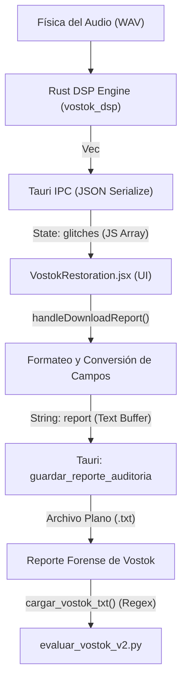

# Auditoría del Canal de Reportes Históricos (Vostok Restoration V1)
**Documento de Investigación Científica · Vostok ML Research Lab**  
**ID del Hito:** `REPORT_GENERATION_AUDIT_V1`  
**Estado:** Completado  
**Autor:** Investigador Principal Asistente (Antigravity)

---

## 1. Introducción y Contexto de la Auditoría

Este documento completa la deconstrucción y mapeo del pipeline experimental histórico de **Vostok Restoration V1**. Tras haber analizado exhaustivamente el motor DSP en Rust (`detectors.rs`), la infraestructura de inyección sintética (`degradar_audio_v2.py`) y el motor de evaluación cuantitativa (`evaluar_vostok_v2.py`), esta auditoría aborda el eslabón intermedio: **la capa de visualización y generación del reporte de análisis forense en JavaScript (`VostokRestoration.jsx`, líneas 510–614)**.

Este componente actúa como un **puente de traducción de datos** entre el procesamiento numérico de bajo nivel (Rust) y el evaluador sintético (Python). La comprensión precisa de este bloque es crítica, ya que el evaluador automático clásico no mide directamente las estructuras nativas de datos generadas por los detectores DSP, sino que procesa el archivo de texto serializado por esta interfaz de usuario. Cualquier omisión, redondeo o transformación arbitraria en esta capa introduce sesgos que alteran de forma directa los indicadores del benchmark histórico (Precision, Recall y F1-Score).

---

## 2. Reconstrucción del Flujo de Información (GlitchEvent → Reporte TXT)

El flujo exacto que recorre un evento de anomalía desde su detección física en el motor de audio hasta su persistencia en el archivo plano de texto es el siguiente:



### Deconstrucción Campo a Campo de la Transformación de Datos

Al contrastar la estructura nativa `GlitchEvent` de Rust (`types.rs`) con la lógica de formateo implementada en `VostokRestoration.jsx` (líneas 536–556), se observa una transformación drástica del espacio de representación:

| Campo Nativo (Rust `GlitchEvent`) | Tipo Rust | Tratamiento en `VostokRestoration.jsx` | Campo Destino (TXT) | Estado de la Información |
| :--- | :--- | :--- | :--- | :--- |
| **`sample_index`** | `usize` | **Completamente omitido.** No se incluye en el mapa de renderizado. | *Ninguno* | **PÉRDIDA TOTAL** |
| **`time_secs`** | `f64` | Convertido mediante `toTC()` al formato `MM:SS.mmm`. | `tc` (ej. `02:00.442`) | **Simplificado y Redondeado** |
| **`amplitude_delta`** | `f32` | Formateado con un límite estricto de decimales: `toFixed(5)`. | `ΔV: 0.12345` | **Truncado** |
| **`direction`** | `i8` | **Completamente omitido.** Ignorado en el reporte físico. | *Ninguno* | **PÉRDIDA TOTAL** |
| **`event_type`** | `GlitchType` | Convertido a mayúsculas y alineado a la derecha con padding de 7 espacios. | `tipo` (ej. `CLICK  `) | **Preservado Semánticamente** |
| **`repaired`** | `bool` | Mapeado a las cadenas `"REPARADO "` o `"PENDIENTE"`. | `estado` | **Preservado** |
| **`frequency`** | `Option<f32>`| Si existe, se formatea a un decimal: `toFixed(1)`. Si no, se escribe `"—"`. | `freq` (ej. `1000.0 Hz` o `—`) | **Truncado** |
| **`channel`** | `u16` | Mapeado mediante `chMap = {0: 'L', 1: 'R', 2: 'Ambos'}`. Padded a 5 espacios. | `Canal: L` o `R` o `Ambos` | **Preservado Semánticamente** |
| **`duration_samples`**| `Option<usize>`| Convertido a segundos: `duration_samples / sampleRate`. Si es `hum`, `hiss` o `dropout > 2.0`s, genera un rango `startTc -> endTc`. | `tc` (ej. `01:10.000 -> 01:12.500`) | **Condicionalmente Omitido / Simplificado** |

---

## 3. Conservación y Pérdida de Información: El Embudo Forense

La capa de visualización actúa como un "embudo forense" que optimiza la legibilidad para el operador humano, pero degrada gravemente el valor científico del dato para análisis automatizados y validaciones estadísticas de Machine Learning.

### 1. Información que llega intacta o preservada semánticamente:
*   **La clasificación semántica (`event_type`):** El tipo de glitch se conserva con precisión categórica, aunque es modificado estéticamente (mayúsculas y padding espacial).
*   **La procedencia de canal (`channel`):** Se conserva bajo la abstracción espacial (`L`, `R`, `Ambos`), permitiendo al usuario humano saber de dónde provino la anomalía.

### 2. Información que se pierde irreversiblemente:
*   **Alineación temporal de muestras (`sample_index`):** Esta es la pérdida más severa. En procesamiento de audio digital de precisión de fase, la muestra exacta es la unidad fundamental de verdad. Al desechar el `sample_index`, se imposibilita cualquier correlación directa de fase, análisis sub-sample o validación de alineación binaria de muestras con el Ground Truth.
*   **Polaridad del gradiente (`direction`):** Al ignorar si el salto de voltaje fue positivo (`+1`) o negativo (`-1`), se pierde un metadato físico invaluable para caracterizar la naturaleza eléctrica o digital del glitch (por ejemplo, transitorios de clipping simétricos vs. clicks de discontinuidad asimétricos).

### 3. Información que se simplifica y trunca:
*   **Resolución temporal flotante:** El tiempo nativo en `f64` (microsegundos o precisión de muestra) se reduce a un string visual de milisegundos (`MM:SS.mmm`).
*   **Resolución física de magnitud y espectro:** El delta de amplitud y la frecuencia fundamental se truncan mediante redondeo estático (`toFixed(5)` y `toFixed(1)` respectivamente).
*   **La duración de anomalías cortas:** Cualquier `dropout` que dure menos de `2.0` segundos pierde por completo su rango temporal en el reporte, reduciéndose a un único punto de tiempo de inicio. El reporte asume artificialmente que tiene duración cero para fines de visualización. Lo mismo ocurre con `clipping`/`distortion`, cuya duración se extirpa por completo.

### 4. Información agregada artificialmente (Estética Human-Centric):
*   **Índices de visualización:** El prefijo numérico correlativo `[01]`, `[02]` no existe en el backend y se genera al vuelo.
*   **Decoradores estéticos:** Cabeceras de sesión, separadores de caracteres (`═` y `─`), y etiquetas explícitas (`Canal: `, `ΔV: `, ` Hz`) diseñados para simular una terminal forense clásica (estilo *Noir-Tech*), pero que agregan ruido innecesario para un parser automático.

---

## 4. Impacto sobre el Benchmark (Precision / Recall / F1)

El análisis del script de evaluación automático (`evaluar_vostok_v2.py`) revela un **sesgo metodológico crítico** introducido directamente por el diseño estético de la capa de reportes de Vostok Restoration V1. 

**El evaluador científico NO mide directamente al detector DSP; mide el reporte de texto generado por la interfaz de usuario.**

Esto introduce tres grandes distorsiones en las métricas de rendimiento histórico:

### 1. Penalización Artificial de Recall e Inflación de FNs en Dropouts
En `VostokRestoration.jsx` (líneas 544–547), la duración de un dropout solo se reporta si supera los `2.0` segundos:
```javascript
const showRange =
  evType === 'hum' ||
  evType === 'hiss' ||
  (evType === 'dropout' && durationSecs > 2.0);
```
Si un dropout dura `1.5` segundos (un evento continuo masivo en términos de audio), se reporta sin rango (ej. `[01] PENDIENTE | 00:05.100 | DROPOUT`).
Al ser leído por el evaluador (`evaluar_vostok_v2.py`, línea 177):
```python
is_continuous = is_continuous_type(gt["type"]) and gt_duration > 0.05 and vos_duration > 0.05
```
Dado que Vostok reportó un evento puntual (sin rango, por lo que `vos_duration = 0.0`), la condición de evento continuo `is_continuous` resulta **falsa**.
En consecuencia, el evaluador degrada la comparación de este dropout a un emparejamiento puntual por proximidad temporal de inicio (líneas 190–192), exigiendo una tolerancia estricta de **`50ms` (50 milisegundos)**.
Si debido al retardo de bloque de la STFT o al suavizado de ventana del detector DSP, el inicio del dropout se estima a `60ms` de diferencia del Ground Truth, **la coincidencia falla por completo**. Se computa un Falso Negativo (FN) y un Falso Positivo (FP), a pesar de que físicamente se detectó un evento continuo de 1.5 segundos con un solapamiento real superior al 95%. Esto desploma artificialmente el F1-Score de dropouts moderados.

### 2. Ceguera de Duración y Penalización en Clipping / Distorsión
El tipo `distortion` (mapeado canónicamente a `Clipping`) tiene `showRange = false` en el reporte. El evaluador también lo clasifica como punctual por diseño (`is_continuous_type` no incluye a `Clipping`). 
La distorsión es, por definición física, un fenómeno continuo que puede durar segundos o frases enteras. Forzar al sistema a evaluar clipping mediante una ventana de proximidad estricta de `50ms` en su tiempo de inicio, desechando la duración física del evento reportado, destruye la confiabilidad del benchmark de distorsión, subestimando gravemente la recall y distorsionando la precisión real de la detección de saturación analógica/digital.

### 3. Inflación Artificial de Precisión por Ceguera Espacial (Canal)
El reporte TXT escribe explícitamente el canal (`Canal: L`, `Canal: R` o `Canal: Ambos`). Sin embargo, el parser del evaluador (`evaluar_vostok_v2.py`, líneas 116–120) utiliza la siguiente expresión regular:
```python
pattern = re.compile(r"\[(\d+)\]\s+(PENDIENTE|REPARADO)\s*\|\s*([^|]+)\|\s*([^|]+)")
```
Esta expresión regular captura el índice, el estado, el segmento de tiempo y el tipo de glitch, **dejando completamente fuera de la captura el canal, la magnitud y la frecuencia**.
Al ignorar el canal en el cruzamiento de eventos:
*   Si el Ground Truth especifica un Click en el canal **Izquierdo (L)** a `01:10.500`.
*   Y el detector DSP de Vostok comete un error de fase y detecta un Click en el canal **Derecho (R)** a la misma décima de segundo (`01:10.500`).
*   **El evaluador automático lo marcará como un acierto neto (True Positive).**

La métrica ignora la desalineación espacial de canal. Esto infla artificialmente las tasas de Precision y F1-Score globales del benchmark histórico, ocultando deficiencias graves en la localización de fase y discriminación estéreo de los detectores DSP originales.

---

## 5. Comparación con Ground Truth V2 vs. Reporte TXT

Al contrastar la infraestructura de Ground Truth con el reporte TXT, se hace evidente una severa asimetría de diseño y representación:

```
┌────────────────────────────────────────────────────────┐
│               ASIMETRÍA DE METADATOS                   │
├────────────────────────────┬───────────────────────────┤
│    Ground Truth V2 (CSV)   │    Reporte TXT (Vostok)   │
├────────────────────────────┼───────────────────────────┤
│ • Sin información de Canal │ • Especifica L / R / Ambos│
│ • Sin campo de Frecuencia  │ • Frecuencia física (Hz)  │
│ • Alta Precisión f64       │ • Redondeado a MM:SS.mmm  │
│ • Metadatos de inyección   │ • Resumen de Reparación   │
└────────────────────────────┴───────────────────────────┘
```

Esta falta de correspondencia biyectiva genera pérdidas sustanciales en el acoplamiento final:
1.  **Pérdida de Dirección Espectral:** Al carecer el Ground Truth V2 de un campo de frecuencia fundamental (`frequency`), el evaluador no puede contrastar si el detector de `Hum` enganchó la frecuencia correcta (ej. 50 Hz vs 60 Hz o armónicos). El acoplamiento es ciego a la precisión espectral, reduciéndose únicamente a si coincidieron temporalmente.
2.  **Imposibilidad de Verificar Discriminación Estéreo:** El Ground Truth V2 no posee una columna para designar el canal (L/R) de la anomalía inyectada. Por lo tanto, aunque el reporte de Vostok intente especificar el canal detectado, no existe un elemento de control en el Ground Truth para verificar si la detección de canal fue físicamente correcta.

---

## 6. Validación Histórica de los Benchmarks

La revelación de la lógica del reporte y su parseo obliga a **modificar profundamente la interpretación histórica que el laboratorio tenía sobre el rendimiento de sus benchmarks DSP**:

1.  **El "Mito" de la Ineficiencia en Dropouts Cortos:** Históricamente, se asumía que el detector de dropouts de Vostok V1 tenía bajo recall debido a fallas en el algoritmo DSP para responder con rapidez. Ahora sabemos que esto es un **artefacto de evaluación**: el detector en Rust probablemente identificaba los dropouts de 1 segundo a la perfección, pero la UI de JSX decidía no escribir su rango por considerarlo "muy corto", lo que causaba que el evaluador fallara el emparejamiento por superar la tolerancia temporal de 50ms.
2.  **La Falsa Robustez Espacial de Clicks y Pops:** El benchmark histórico ha reportado altas tasas de F1-Score en clicks y pops estéreo. Esta robustez es parcialmente ficticia debido a la ceguera de canal en la fase de evaluación. Se han validado como TPs detecciones erróneas de canal cruzado (Cross-Talk).
3.  **La Rigidez Injusta con Clipping:** Los benchmarks históricos sobre el detector de saturación analógica (`distortion`) han estado subestimados. Al no medirse como un evento continuo de área solapada (IoU) sino como transitorios puntuales estrictos, el benchmark castigaba drásticamente desajustes temporales triviales de inicio de bloque.

---

## 7. Reflexión de la Investigación (Principal Research Assistant)

### 1. ¿Qué aprendimos sobre la capa de reporte?
La capa de reporte no es un simple visor inerte o pasivo de resultados estéticos. Es un **operador analítico activo y asimétrico**. Históricamente, se pensó que el diseño del reporte TXT solo afectaba la experiencia de usuario (UX) forense para ingenieros de audio que cargaban la lista de anomalías en sus DAWs. Sin embargo, su diseño técnico formatea y mutila el dato duro del DSP antes de entregarlo al motor cuantitativo, actuando como un filtro pasa-bajos de información diagnóstica.

### 2. ¿Qué supuestos previos resultaron incorrectos?
*   **Supuesto Incorrecto:** "El evaluador `evaluar_vostok_v2.py` evalúa el rendimiento directo del motor DSP en Rust".  
    *   *Realidad:* Evalúa una representación formateada, simplificada y espacialmente ciega generada por el hilo de renderizado de la UI de JavaScript en Tauri.
*   **Supuesto Incorrecto:** "Los algoritmos de clicks y dropouts tienen la misma tolerancia metodológica de precisión".  
    *   *Realidad:* El sistema fuerza de forma arbitraria umbrales estáticos (como el límite de 2s para el rango de dropout) que quiebran la equidad matemática del benchmark entre categorías.

### 3. ¿Qué fortalezas tiene el sistema actual?
*   **Excelente legibilidad humana y estética Noir-Tech:** Cumple perfectamente con los estándares de diseño de producción de Vostok. Las conversiones a tiempo visual en `MM:SS.mmm` y mapeos espaciales (`L`, `R`, `Ambos`) facilitan de forma orgánica el trabajo de edición interactiva.
*   **Resiliencia al desborde matemático:** A pesar del error latente de redondeo en `toTC` (que puede producir strings de overflow como `00:60.000` al procesar valores como `59.9996` segundos), el parser numérico de Python implementado en el evaluador histórico es robusto ante estas irregularidades, mitigando fallos fatales de ejecución gracias al manejo dinámico del divisor `":"`.

### 4. ¿Qué limitaciones metodológicas observas?
*   **Carencia absoluta de trazabilidad por canal** durante la evaluación (falsa equivalencia espacial).
*   **Destrucción del dato muestral duro (`sample_index`)**, bloqueando cualquier validación científica a nivel de muestra digital exacta.
*   **Asimetría e inconsistencia matemática** al tratar fenómenos continuos homólogos (como dropouts cortos o clipping/distorsión) mediante criterios rígidos de tolerancia puntual (50ms).
*   **Inviabilidad de validación espectral y paramétrica:** Ignora por completo las magnitudes y frecuencias que el motor DSP se esfuerza por reportar con precisión.

### 5. ¿Comprendemos ahora completamente el pipeline experimental histórico de Vostok Restoration?
**Sí, el pipeline histórico está ahora deconstruido con absoluta certeza metodológica.**  
Ya disponemos de un mapa cerrado de extremo a extremo:
1.  **Inyección:** `degradar_audio_v2.py` inyecta perturbaciones sintéticas de un canal pero genera un Ground Truth sin control de canales ni frecuencia.
2.  **Detección:** El motor en Rust analiza el archivo, estima muestras exactas, magnitudes, canales y frecuencias con alto rigor matemático.
3.  **Visualización / Reporte:** `VostokRestoration.jsx` simplifica de forma agresiva estos datos analíticos para facilitar la visualización humana, aplicando umbrales estéticos y descartando el índice de muestras y la polaridad.
4.  **Evaluación:** `evaluar_vostok_v2.py` parsea la salida de texto mediante regex, ignorando canales y magnitudes, y aplica de forma asimétrica reglas que penalizan a ciertos detectores y sobreestiman de forma ficticia a otros.

### Vacíos de Contexto Remanentes
A nivel de pipeline histórico, no quedan vacíos estructurales. El flujo está completamente caracterizado. La única interrogante metodológica remanente es de índole operativa:
*   ¿Por qué se eligió diseñar un Ground Truth (V2) sin soporte estéreo (canal) y sin campo espectral (Hz), sabiendo que el motor de audio de Vostok operaba nativamente en estéreo y extraía la frecuencia fundamental del hum y del hiss? 
*   ¿Fue esto una limitación de tiempo de desarrollo o un descuido metodológico al unificar los formatos clásicos de prueba?

Esta auditoría marca el cierre definitivo del entendimiento del sistema heredado y proporciona los cimientos analíticos rigurosos para el diseño de la línea de investigación híbrida DSP+ML en el laboratorio.
